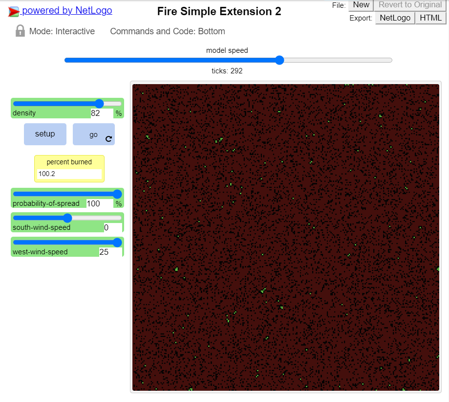
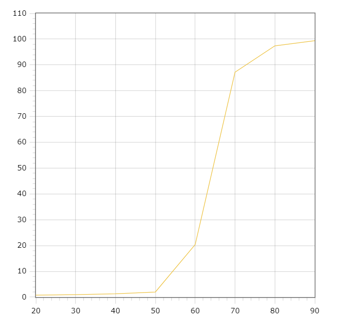
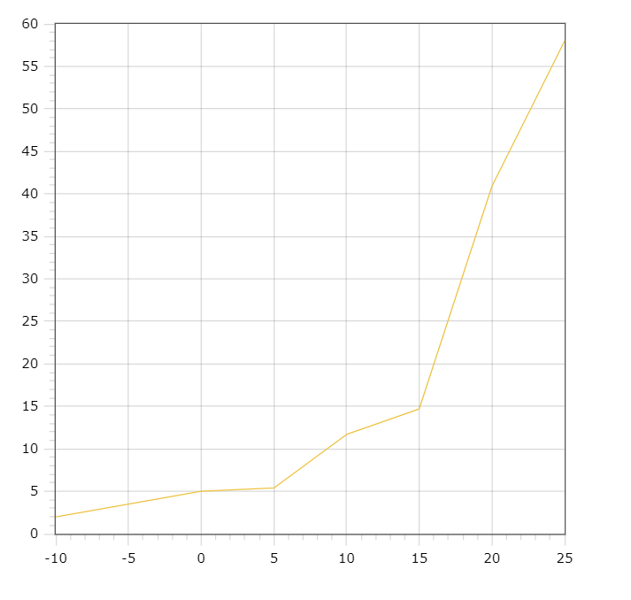

## Комп'ютерні системи імітаційного моделювання
## СПм-22-3, **Гриценко Іван Костянтинович**
### Лабораторна робота №**1**. Опис імітаційних моделей та проведення обчислювальних експериментів

 

### Варіант 5, модель у середовищі NetLogo:
[Fire Simple Extension 2](http://www.netlogoweb.org/launch#http://www.netlogoweb.org/assets/modelslib/IABM%20Textbook/chapter%203/Fire%20Extensions/Fire%20Simple%20Extension%202.nlogo)

 

### Вербальний опис моделі:
Симуляція розповсюдження вогню через ліс. Лінія вогну бере початок з лівої, або ж західної в термінології програми частини та за допомогою правил та впливаючих параметрів розповсюджується в протилежну сторону. Кожен елемент вогню має шанс розповсюдитися на сусідні клітини лісу. Густота лісу задається на початку симуляції, а на шанс розповсюдитися впливають безпосередньо одноіменний параметр та напрямки вітру. 

### Керуючі параметри:
- **density** визначає щільність покриття площини лісом.
- **probability of spread** визначае початково задану вірогідність розповсюдження вогню на сусідню клітинку.
- **south-wind-speed** визначає швидкість південного вітру.
- **west-wind-speed** визначає швидкість західного вітру.

### Внутрішні параметри:
- **initial-trees**. Конкретна кількість дерев на старті програми.

### Показники роботи системи:
- **percent burned** - Відносна кількість сгорівших дерев.

### Недоліки моделі:
Малі масштаби обраного поля значно впливають на репрезентативність дослідженнь. Деякі конфігурації вітру повністю нівелюють розповсюдження вогню на деякі сусідні клітини, що не є достовірною репрезентацією реального світу.
Обмежена конфігурація швидкості вітру.

На малюнку відображена зломана поведінка обчислення кінцевої кількості спалених дерев.
 

## Обчислювальні експерименти

### 1. Вплив вірогідності розповсюдження вогню на кінцеву кількість спалених дерев

Досліджується залежність кінцевого показнику зпалених дерев від вірогідності розповсюдження вогню. Кінець симуляції визначає кількість тактів.
Експерименти проводяться при 20-90 відсодках вірогідності, з кроком 10, усього 8 симуляцій.  
Інші керуючі параметри мають значення за замовчуванням:
- **density**: 80
- **south-wind-speed**: 15
- **west-wind-speed**: 10

<table>
<thead>
<tr><th>Вірогідність розповсюдження</th> <th>Відсоток згорівших дерев</th></tr>
</thead>
<tbody>
<tr><td>20</td><td>0.8</td></tr>
<tr><td>30</td><td>1</td></tr>
<tr><td>40</td><td>1.3</td></tr>
<tr><td>50</td><td>2</td></tr>
<tr><td>60</td><td>20.4</td></tr>
<tr><td>70</td><td>87.2</td></tr>
<tr><td>80</td><td>97.4</td></tr>
<tr><td>90</td><td>99.4</td></tr>
</tbody>
</table>

 

Графік наочно показує, що для кінцева кількість спалених дерев залежить від того більше чи менше 50% вірогідність розповсюдження. І чим більше вірогідність ніж 50% тим критичніше це впливає на кількість зпалених дерев

### 2. Перевірка гіпотези про те, що швидкість вітру може критично впливати на кінцеву кількість спалених дерев.
 
Досліджується гіпотеза про те, що швидкість вітру може значно змінити кількість кінцево спалених дерев на полі.Кінець симуляції визначає кількість тактів.Експерименти проводяться при -10 та 25 одиницях сили західного вітру , з кроком 5, усього 8 симуляцій.  

Інші керуючі параметри мають значення за замовчуванням:
- **probability-of-spread**: 60
- **south-wind-speed**: 0
- **density**: 80

<table>
<thead>
<tr><th>Швидкість західного вітру</th> <th>Відсоток згорівших дерев</th></tr>
</thead>
<tbody>
<tr><td>-10</td><td>2</td></tr>
<tr><td>-5</td><td>3.5</td></tr>
<tr><td>0</td><td>5</td></tr>
<tr><td>5</td><td>5.4</td></tr>
<tr><td>10</td><td>11.7</td></tr>
<tr><td>15</td><td>14.7</td></tr>
<tr><td>20</td><td>40.9</td></tr>
<tr><td>25</td><td>58</td></tr>
</tbody>
</table>

Графік наочно показує що при певній конфігурації сила вітру може критично впливати на розповсюдження вогню та відповідно на кінцеву кількість спалених дерев. 

### 3. Підбір мінімального dencity достатньої для повного спалення лісу.
 
Досліджується можливість конфігурації яки призведе до показника спалення дерев 100% та визнача та визначається мінімальний показник щільності лісу який дає таку можливість. Експеримент проводиться до визначення мінімального показника повного згоряння. Регулюється параметр dencity.

Інші керуючі параметри мають значення за замовчуванням:
- **probability-of-spread**: 100
- **south-wind-speed**: 0
- **west-wind-speed**: 25
 
 <table>
<thead>
<tr><th>Щільність лісу</th> <th>Відсоток згорівших дерев</th></tr>
</thead>
<tbody>
<tr><td>30</td><td>2</td></tr>
<tr><td>40</td><td>2.4</td></tr>
<tr><td>50</td><td>4</td></tr>
<tr><td>60</td><td>43.2</td></tr>
<tr><td>70</td><td>97</td></tr>
<tr><td>80</td><td>100</td></tr>
<tr><td>79</td><td>99.9</td></tr>
</tbody>
</table>

 

За результами дослідженнь виявлено, що мінімальна щільність дерев яка призводить до повного вигорання - 80%. 